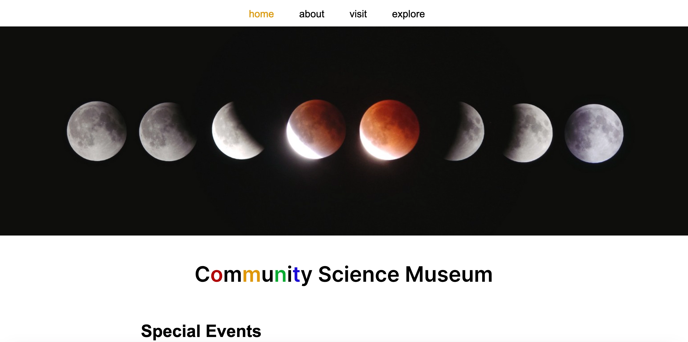

# Community Science Museum



**Deployed website:** [Community Science Museum](https://telecasteren-semester1.netlify.app/)<br/>
A pure vanilla HTML and CSS website I designed and built during my first semester at Noroff School of Technology and Digital Media.

## Description

This is the website for the vibrant family museum, Community Science Museum. It was originally built with vanilla HTML and CSS, following a school provided brief with content instructions. The website will give a feeling of what kind of museum Community Science Museum is, and be informative towards its guests on what events are one and how to find them. The sites client segment are elder children and families.

## Built With Vanilla

- HTML
- CSS

## Installing and running

1. Clone the repo:

```bash
git clone git@github.com:telecasteren/semesterProject1.git
```

2. Run with Live server locally.<br/>
   You may play around with it on your machine as you like, and if you want to contribute, read more in the section [Contributing](#contributing).

## Contributing

You are welcome to contribute to this project. The only requirements is that you keep the intention of the website, that being a website for a community museum, where the user-segment are families and children. Make sure to open a pull request (PR), so code can be reviewed before it's implemented.

**Known areas for improvements:**

- Accessibility, form and li element proper syntax structures
- Simplifying and strengthening CSS styling and responsiveness
- Separating text content concerns from HTML structure
- Converting static HTML content to dynamic javascript

## Contact

- [My website - telecasternilsen](https://telecasternilsen.netlify.app/)
- [GitHub profile](https://github.com/telecasteren)
- [LinkedIn profile](https://www.linkedin.com/in/tele-caster-nilsen-7002b9249/)

## Some of my other work

- [My portfolio page](https://tcn-portfolio.netlify.app/)
- [My website - telecasternilsen](https://telecasternilsen.netlify.app/)

## Acknowledgements

### Images on /navigate/exhibitions/index.html page:

**Blue planet:**
Photo by <a href="https://unsplash.com/@simonppt?utm_content=creditCopyText&utm_medium=referral&utm_source=unsplash">SIMON LEE</a> on <a href="https://unsplash.com/photos/a-picture-of-the-earth-taken-from-space-nVghQWPCRbI?utm_content=creditCopyText&utm_medium=referral&utm_source=unsplash">Unsplash</a>

**Red planet:**
Photo by <a href="https://unsplash.com/@planetvolumes?utm_content=creditCopyText&utm_medium=referral&utm_source=unsplash">Planet Volumes</a> on <a href="https://unsplash.com/photos/a-close-up-of-a-planet-with-a-black-background-awYEQyYdHVE?utm_content=creditCopyText&utm_medium=referral&utm_source=unsplash">Unsplash</a>

**Galileo Galilei:**<br/>
Photo downloaded from https://www.worldhistory.org/image/17766/galileo-demonstrating-his-telescope/
